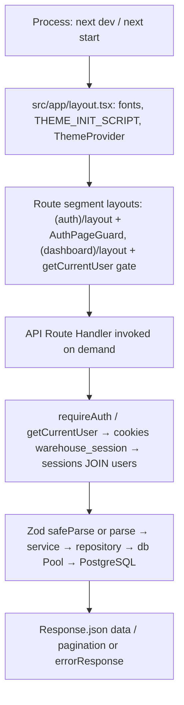
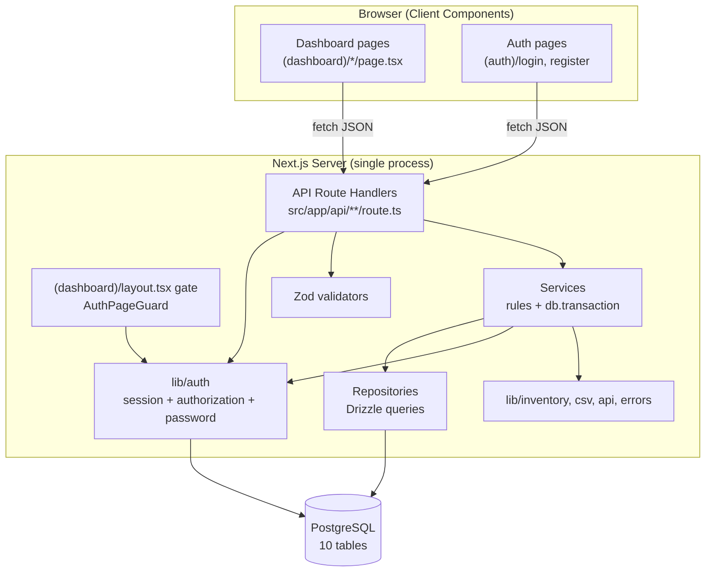
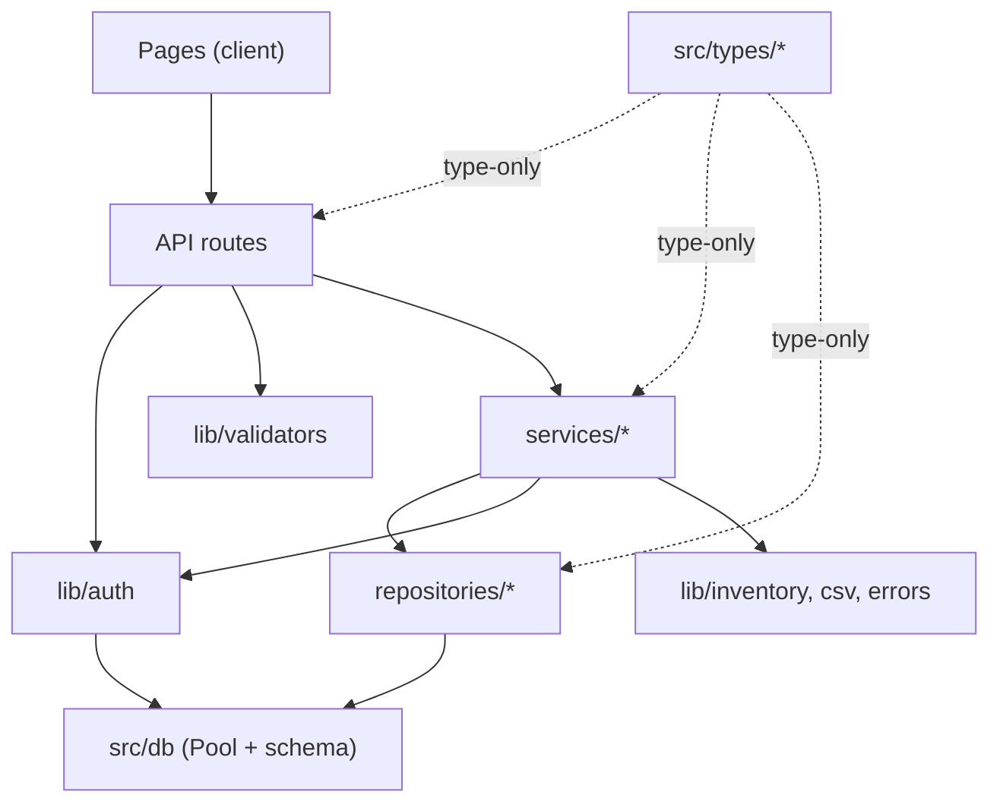
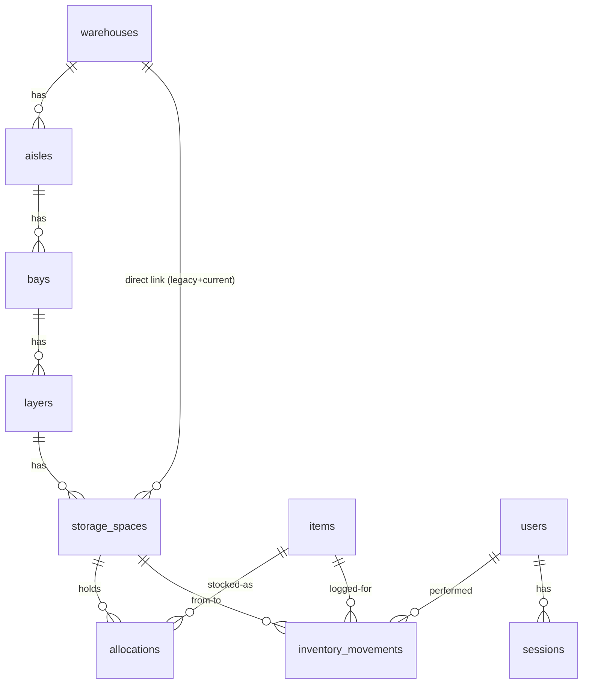
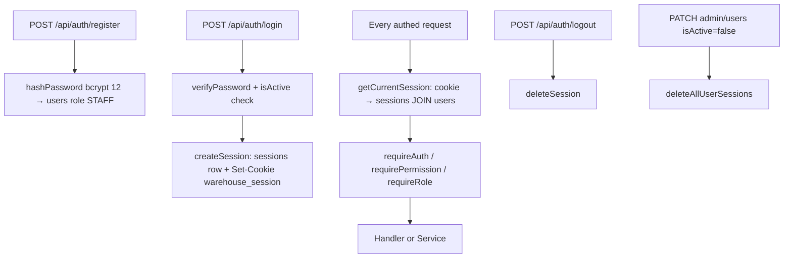
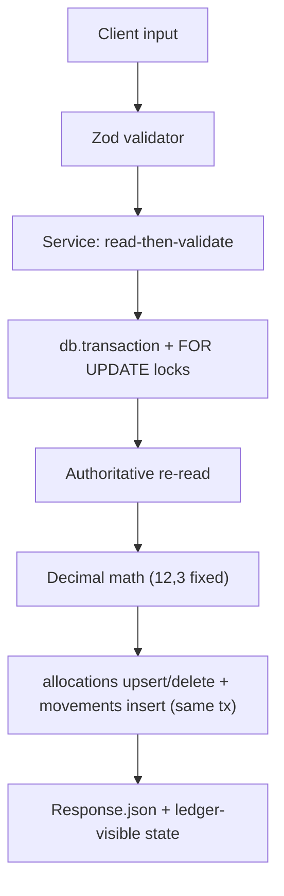
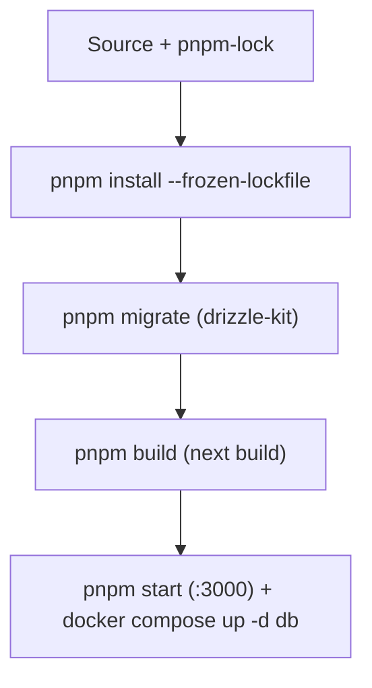

# Warehouse Management — Architecture Study Notes

> Stack: **Next.js 16.3.5 (App Router) + React 19 + PostgreSQL 17 + Drizzle ORM 0.45.2 + Zod 4 + Tailwind CSS 4 + pnpm 10**. Single-deployable monolith: server-rendered pages + colocated JSON API routes + service/repository data layer. No separate backend, no middleware, no custom server.

Start here: `package.json` → `src/db/schema/index.ts` → `src/db/index.ts` → `src/lib/auth/session.ts` + `authorization.ts` → `src/services/allocation.service.ts` → `src/app/api/allocations/route.ts` → `src/app/(dashboard)/allocations/page.tsx`.

---

## 1. Executive Summary

**What is it?** A warehouse inventory management application. Core domain:

1. **Physical hierarchy:** `Warehouse → Aisle → Bay → Layer → StorageSpace`. New hierarchy (`aisles/bays/layers`) was added additively; `storage_spaces.warehouse_id` remains the authoritative link during migration.
2. **Catalog:** `items` (`sku` unique, `unit`, optional `requiredStorageType`).
3. **Stock:** `allocations` (`item_id, storage_space_id → quantity NUMERIC(12,3)`). There is **no denormalized stock column**; totals are always `SUM(allocations.quantity)`.
4. **Ledger:** `inventory_movements` (`ALLOCATE | MOVE | RELEASE`, `from/to` space refs, `created_by`). Every mutation writes a movement row in the same DB transaction.
5. **Identity:** DB-backed sessions (`sessions` table + `warehouse_session` HttpOnly cookie), `ADMIN | STAFF` roles.

**Confirmed** (directly observed): `src/db/schema/*`, `src/services/allocation.service.ts → allocateInventory()`, `src/services/transfer.service.ts → transferInventory()`, `src/services/release.service.ts → releaseInventory()`, `src/repositories/allocation.repository.ts`, `src/lib/auth/*`, 29 `src/app/api/**/route.ts` files, `tests/` (13 files).

---

## 2. Technology Stack

| Concern | Choice (Confirmed via `package.json`, configs, code) | Evidence |
|---|---|---|
| Framework | Next.js `16.3.5` App Router, React `19.2.8` | `package.json`, `src/app/layout.tsx`, `src/app/**/page.tsx`, `route.ts` |
| Language | TypeScript `^5`, strict, `paths: @/* → ./src/*` | `tsconfig.json`, `typecheck` script |
| DB | PostgreSQL `17` (Docker), `pg ^8.23` + `drizzle-orm ^0.45.2` | `docker-compose.yml`, `src/db/index.ts`, `drizzle.config.ts` |
| Migrations | `drizzle-kit ^0.31.10`, SQL in `src/db/migrations/` | `drizzle.config.ts`, `package.json#migrate/generate` |
| Validation | `zod ^4.6.5` | `src/lib/validators/*` |
| Auth crypto | `bcryptjs ^3.0.3`, `SALT_ROUNDS=12` | `src/lib/auth/password.ts` |
| Decimal math | `decimal.js ^10.6.0` | `src/lib/inventory/decimal.ts`, services |
| Styling | `tailwindcss ^4` via `@tailwindcss/postcss`, `clsx`, `tailwind-merge`, `lucide-react` | `postcss.config.mjs`, `src/app/globals.css`, `src/lib/utils.ts → cn()` |
| Tests | `vitest ^5`, `vite-tsconfig-paths`, custom `global-setup.ts` | `vitest.config.mts` |
| Runtime/Mgr | Node 20+, `pnpm@10.34.5` | `README.md`, `packageManager`, `pnpm-lock.yaml`, `pnpm-workspace.yaml` |
| Fonts | Self-hosted Geist via `next/font/local` | `src/app/layout.tsx`, `src/app/fonts/` |

No Redis/queue/cache/search/payment/observability vendor. **Not established from the repository:** any cloud provider or production host (no Dockerfile, no CI YAML, no Terraform).

---

## 3. Repository Structure

```text
warehouse-management/
├── src/
│   ├── app/                        # Next.js App Router: pages + API routes
│   │   ├── layout.tsx              # Root layout (fonts, theme script, ThemeProvider)
│   │   ├── globals.css             # Tailwind v4 + dark-mode vars
│   │   ├── (auth)/                 # Public group: layout + login/ + register/
│   │   ├── (dashboard)/            # Authed group: layout (gate) + 8 sections
│   │   └── api/                    # 29 route.ts files (JSON API)
│   ├── components/
│   │   ├── auth/auth-page-guard.tsx
│   │   ├── layout/app-shell.tsx, header.tsx, sidebar.tsx, navigation.ts
│   │   ├── theme/theme-provider.tsx, theme-toggle.tsx
│   │   └── warehouse/warehouse-structure-tree.tsx
│   ├── db/
│   │   ├── index.ts                # pg Pool + drizzle(db) singleton
│   │   ├── transaction.ts          # DbTransaction type alias only
│   │   ├── schema/                 # 10 Drizzle tables + enums (source of truth)
│   │   └── migrations/             # 0000, 0001, 0002 + meta snapshots + journal
│   ├── lib/
│   │   ├── auth/auth.ts, session.ts, password.ts, authorization.ts
│   │   ├── errors/errors.ts, database.ts
│   │   ├── api/error-response.ts, pagination.ts, list-query.ts
│   │   ├── validators/*.ts         # 13 Zod modules
│   │   ├── inventory/capacity.ts, decimal.ts, location-path.ts, storage-type.ts
│   │   ├── csv/item-csv.ts
│   │   ├── theme.ts, utils.ts
│   ├── repositories/               # 10 files (1 empty) — Drizzle queries only
│   ├── services/                   # 11 files + helpers/common.ts — business rules
│   └── types/                      # 12 DTO/query/pagination interfaces
├── tests/
│   ├── integration/helpers.ts, global-setup.ts
│   ├── integration/*.test.ts (7), concurrency/*.test.ts (2), unit/*.test.ts (2)
├── scripts/backfill-physical-hierarchy.mjs
├── public/*.svg (default Next assets)
├── docker-compose.yml, drizzle.config.ts, next.config.ts
├── vitest.config.mts, tsconfig.json, eslint.config.mjs, postcss.config.mjs
├── package.json, pnpm-workspace.yaml, pnpm-lock.yaml
├── README.md, AGENTS.md, CLAUDE.md, cookies.txt, .env, .env.local
└── .next/, node_modules/ (generated — not architecturally relevant)
```

Route groups `(auth)` / `(dashboard)` affect layout only, not URLs. `src/app/api/*` URL maps 1:1 to filesystem path.

---

## 4. Folder-by-Folder Explanation

### `src/app/` — Entry, routing, UI, API

**What:** Next.js App Router root. Every HTTP entry point (pages render HTML, `api/**/route.ts` serve JSON).
**Why:** Framework-mandated boundary; colocating UI + API in one deployment is the core monolith decision.
**Depends on:** `components/`, `lib/auth/*`, `services/*` (via API routes only — pages call `fetch`, never services directly).
**Important files:** `layout.tsx`, `(dashboard)/layout.tsx`, `(auth)/login/page.tsx`, `api/warehouses/route.ts`, `api/allocations/route.ts`, `api/transfers/route.ts`, `api/releases/route.ts`.

### `src/components/` — Presentational + shell

8 files. `layout/*` (shell/sidebar/header/nav), `theme/*`, `auth-page-guard.tsx`, `warehouse-structure-tree.tsx`. No business logic except role-filtering nav (`sidebar.tsx` filters `roles: ["ADMIN"]`) and theme state.

### `src/db/` — Persistence boundary

Connection (`index.ts`), transaction type (`transaction.ts`), schema (`schema/`), migrations (`migrations/`). Single choke point for all SQL. `server-only` import prevents client bundling. Depends on `process.env.DATABASE_URL`, `pg`, `drizzle-orm`. Every repository + `lib/auth/*` + transactional services depend on it.

### `src/lib/` — Cross-cutting primitives

| Subdir | Responsibility | Key exports |
|---|---|---|
| `lib/auth/` | Identity, sessions, RBAC | `registerUser/loginUser/logoutUser/getCurrentUser`, `createSession/getCurrentSession/deleteSession/deleteAllUserSessions`, `requireAuth/requireRole/requirePermission`, `hashPassword/verifyPassword` |
| `lib/errors/` | Typed errors + PG helper | `AppError/NotFoundError/ConflictError/UnauthorizedError/ForbiddenError/CapacityExceededError`, `isPostgresUniqueViolation` |
| `lib/api/` | HTTP plumbing | `errorResponse`, `resolvePagination/clampPageSize`, `parseListQuery` |
| `lib/validators/` | Zod input schemas (13 files) | e.g. `createAllocationSchema`, `createTransferSchema`, `releaseInventorySchema` |
| `lib/inventory/` | Pure domain helpers | `calculateAvailableCapacity/canFitQuantity`, `addDecimal/subtractDecimal/compareDecimal`, `formatLocationPath`, `normalizeStorageType`, `STORAGE_TYPES` |
| `lib/csv/` | CSV codec + limits | `serializeItemsToCsv/parseCsvText/mapItemCsvHeader`, `ITEM_IMPORT_MAX_BYTES=2MB`, `MAX_ROWS=1000`, `EXPORT_MAX=50k` |

### `src/repositories/` — Data access (Drizzle only, no rules)

10 modules; `transfer.repository.ts` is **empty (0 bytes)**. All queries live here; services never write raw SQL except two `tx.select()` item-existence checks in transfer/release services. `allocation.repository.ts` (621 lines) is the concurrency core: `lockWarehouses/lockStorageSpaces` (`SELECT … FOR UPDATE`), `findEligibleStorageSpaces`, hierarchy-aware `warehouseMembershipCondition`, per-level `getAllocatedQuantityFor{Warehouse,Aisle,Bay,Layer,StorageSpace}` guards.

### `src/services/` — Business rules + transactions

11 modules. Owns validation-after-read, capacity math, `db.transaction()` boundaries, movement writes, `requireRole("ADMIN")` delete guards, `requirePermission("USER_MANAGE")` user admin. `warehouse/aisle/bay/layer/storage-space/item` are CRUD + guards; `allocation/transfer/release` are transactional workflows; `dashboard/inventory-movement/user` are read/aggregate or admin flows.

### `src/types/` — Shared DTOs

12 files, pure types (no runtime). `quantity`/`capacity`/`allocatedQuantity` are **`string`** (Drizzle `numeric` maps to string; `Decimal` used for math, `toFixed(3)` on write).

### `tests/` — Three layers

* `unit/` — pure functions (`item-csv`, `theme`), no DB/server.
* `integration/` — live HTTP against `TEST_BASE_URL` + direct `pg` probes + transactional cleanup.
* `concurrency/` — parallel `Promise.all` allocation/transfer races asserting no over-allocate/deadlock.

### `scripts/` — One migration helper

`backfill-physical-hierarchy.mjs` — idempotent Step-2 backfill (NOT a Drizzle migration). Creates `UNASSIGNED` aisle/bay/layer per warehouse, repoints `storage_spaces.layer_id IS NULL`, aborts if NULLs remain.

---

## 5. Important Files

| Path | Why it matters |
|---|---|
| `src/db/schema/index.ts` + `*.ts` | Authoritative data model; start here |
| `src/db/index.ts` | `Pool` + `drizzle(pool,{schema})` singleton; `server-only` |
| `src/db/transaction.ts` | `DbTransaction` type used by every transactional repo method |
| `src/lib/auth/session.ts` | Cookie `warehouse_session`, 24h expiry, `httpOnly/lax`, expiry + `isActive` checks |
| `src/lib/auth/authorization.ts` | 15 `Permission` values, `ADMIN` vs `STAFF` map (STAFF lacks 4 deletes + `USER_MANAGE`) |
| `src/services/allocation.service.ts → allocateInventory()` | Split-fill allocate under `FOR UPDATE` locks + `ALLOCATE` movements, all-or-nothing |
| `src/services/transfer.service.ts → transferInventory()` | `MOVE` with source/dest locks, type + capacity checks, zero-row deletion |
| `src/services/release.service.ts → releaseInventory()` | `RELEASE` with warehouse lock + allocation decrement/delete |
| `src/repositories/allocation.repository.ts` | Lock + aggregation queries; hierarchy/legacy `OR` branches |
| `src/app/(dashboard)/layout.tsx` | Server auth gate (`redirect("/login")`) for all dashboard pages |
| `src/components/layout/navigation.ts` | Canonical nav + `Users roles:[ADMIN]` |
| `drizzle.config.ts` | `schema: ./src/db/schema/index.ts`, `out: ./src/db/migrations`, `DATABASE_URL` fallback |
| `docker-compose.yml` / `.env` / `.env.local` | Actual DB is `warehouse2 @ localhost:5433` — contradicts `README.md` |
| `tests/integration/helpers.ts` | Seed/cleanup contract every integration test relies on |
| `tests/integration/global-setup.ts` | Auto-starts `next dev --port 3100` if no server reachable |

---

## 6. Application Entry Points

| Entry | Path | Type |
|---|---|---|
| Root layout | `src/app/layout.tsx` | Server component (fonts, theme script, provider) |
| Public pages | `src/app/(auth)/login/page.tsx`, `register/page.tsx` | Client components (`fetch` to API) |
| Dashboard pages | `src/app/(dashboard)/*/page.tsx` (15 pages) | All client components fetching JSON API |
| JSON API | `src/app/api/**/route.ts` (29 files) | Route Handlers (`GET/POST/PATCH/DELETE`) |
| DB CLI | `drizzle-kit migrate/generate/studio` | `package.json` scripts |
| Backfill | `scripts/backfill-physical-hierarchy.mjs` | Standalone `node` + `pg` |
| Tests | `vitest run` → `tests/**/*.test.ts` | `vitest.config.mts` |

**Confirmed absent:** `src/middleware.ts`, `src/proxy.ts`, `src/instrumentation.ts`, custom `server.js`, Dockerfile, CI YAML. Auth is enforced per-layout/per-handler, not in middleware.

---

## 7. Startup and Initialization Flow



1. **Process starts:** `pnpm dev` (`next dev`), `pnpm build` + `pnpm start` (`next build/start`). `next.config.ts` is near-empty (`allowedDevOrigins: ['10.0.1.228']`).
2. **No framework init code:** no DI container, no route registration file, no DB `connect()`/health check. `src/db/index.ts` constructs `new Pool({connectionString: process.env.DATABASE_URL})` at import time; `pg` connects lazily on first query. If `DATABASE_URL` is unset, it fails on first query — **Confirmed** (no fallback in `db/index.ts`; fallback exists only in `drizzle.config.ts` and backfill script).
3. **Config loading:** `process.env.DATABASE_URL` read directly; `dotenv.config({.env.local}) + dotenv.config({.env})` only in `drizzle.config.ts`, `tests/integration/helpers.ts`, backfill script — **not** in app runtime (Next loads `.env*` itself). `NODE_ENV==="production"` only gates cookie `secure` flag.
4. **Migrations are manual:** `pnpm migrate` (`drizzle-kit migrate`) applies `src/db/migrations/*.sql`. Nothing auto-migrates on boot.
5. **Request-scoped init:** each API handler re-resolves session via `getCurrentSession()` (DB join + expiry + `isActive` check). Each dashboard page load re-checks `getCurrentUser()` in `(dashboard)/layout.tsx`.

| Mode | How started | DB | Notes |
|---|---|---|---|
| Dev | `pnpm dev` (:3000) | `DATABASE_URL` from `.env(.local)` | `secure:false` cookies |
| Prod | `pnpm build && pnpm start` | same env | `secure:true` cookies; same code paths |
| Test | `vitest run` → `global-setup.ts` probes `TEST_BASE_URL ?? :3000` (`/api/auth/me`), else spawns `next dev --port 3100`, waits 120s, kills process group on teardown | same `DATABASE_URL` (no isolated test DB; tests use `RUN_ID`-suffixed codes/SKUs + transactional `cleanup()`) | `testTimeout 60s`, `hookTimeout 120s` |

---

## 8. High-Level Architecture

**Classification: modular monolith — layered + feature-sliced, Next.js App Router variant.**

* **Layered:** `API Route (transport) → Service (rules + transactions) → Repository (Drizzle queries) → PostgreSQL`. UI pages are a separate client tier that talks to the API over `fetch`, never importing services. **Confirmed** by imports.
* **Feature-sliced:** `warehouse/aisle/bay/layer/storage-space/item/allocation/transfer/release/dashboard/user` each own `schema + validator + repository + service + type + API route(s) + page(s)`.
* **Not** MVC, **not** hexagonal (no ports/adapters; Drizzle used directly), **not** microservices/event-driven (single `next` process, no queue; `inventory_movements` is an audit ledger, not an event bus).
* **Deviations from strict layering:**
  1. `transfer.service.ts` / `release.service.ts` issue two direct `tx.select(...).from(items)` existence checks instead of via `itemRepository`.
  2. `dashboard.service.ts` calls `requireAuth()` itself (route already authed).
  3. Delete authorization lives in **services** (`requireRole("ADMIN")`), while most route auth lives in **routes** (`requireAuth()`).
  4. `transfer.repository.ts` exists but is empty; transfer SQL lives in `allocation.repository.ts`.

---

## 9. Architecture Diagram



---

## 10. Module Responsibilities

| Module | Files | Responsibility (Confirmed) |
|---|---|---|
| Warehouses | `schema/warehouses.ts`, `validators/warehouse.ts`, `repositories/warehouse.repository.ts`, `services/warehouse.service.ts`, `types/warehouse.ts`, `api/warehouses/**`, `app/(dashboard)/warehouses/**` | CRUD + paginated list with `totalCapacity/allocatedQuantity` aggregates; `INACTIVE` blocked if inventory; `ADMIN`-only hard delete |
| Aisles/Bays/Layers | mirrored `aisle/bay/layer` files + nested routes (`warehouses/:id/aisles`, `aisles/:id/bays`, `bays/:id/layers`) | Physical hierarchy CRUD; code uniqueness scoped to parent; deactivate/delete blocked if subtree holds inventory |
| StorageSpaces | `schema/storage-spaces.ts` + 4 API routes + 4 pages | Dual-parent create (`layerId` required + `warehouseId` derived/validated); capacity-shrink blocked below allocated; `location-path` + `inventory` sub-resources |
| Items | `schema/items.ts` + `api/items/**` (incl. `export`, `import`, `[id]/allocations`) + 4 pages | SKU-unique catalog; delete blocked if allocated; CSV export/import (all-or-nothing); filtered/paginated lists |
| Allocation | `services/allocation.service.ts`, `api/allocations/route.ts`, `app/(dashboard)/allocations/page.tsx` | Split-fill allocate across eligible spaces under `FOR UPDATE` locks + `ALLOCATE` ledger rows |
| Transfer | `services/transfer.service.ts` (factory), `api/transfers/route.ts`, transfers page | Atomic `MOVE`: source decrement/delete + dest upsert + ledger |
| Release | `services/release.service.ts` (factory), `api/releases/route.ts`, releases page | Atomic `RELEASE`: decrement/delete + ledger |
| Activity | `services/inventory-movement.service.ts`, `api/inventory-movements/route.ts`, `activity/page.tsx` | Filtered/paginated ledger reads + `describeMovement()` formatter |
| Dashboard | `services/dashboard.service.ts`, `repositories/dashboard.repository.ts`, `api/dashboard/route.ts`, `(dashboard)/page.tsx` | `getDashboardOverview()`: summary counts, per-warehouse capacity %, ≥75% alerts, recent 5 movements |
| Users/Admin | `schema/users.ts/sessions.ts`, `services/user.service.ts`, `api/admin/users/**`, `admin/users/page.tsx` | `USER_MANAGE`-gated list/update; last-active-admin guard; deactivation kills sessions |
| Auth | `lib/auth/*`, `api/auth/**`, `(auth)/*`, `auth-page-guard.tsx` | Register (STAFF-only creation), login/logout/me, session cookie lifecycle |
| Theme | `lib/theme.ts`, `components/theme/*`, `app/layout.tsx`, `globals.css` | `light|dark|system`, localStorage + blocking init script, `.dark` class |

---

## 11. Dependency Relationships



Direction is acyclic except UI↔API over HTTP (not imports). No repository imports a service. Shared kernels: `src/types/*`, `src/lib/errors/*`, `src/lib/api/*`, `src/services/helpers/common.ts`. No circular dependencies found.

---

## 12. Data Architecture

Application models (`src/types/*`) mirror Drizzle rows 1:1 except:

* `quantity`/`capacity`/`allocatedQuantity`/`totalCapacity` are **`string`** (Drizzle `numeric` → string). Arithmetic via `decimal.js` (`src/lib/inventory/decimal.ts`); writes normalized with `.toFixed(3)`.
* List rows join display fields: `WarehouseListRow = Warehouse + {totalCapacity, allocatedQuantity}`, `StorageSpaceListRow = StorageSpace + {warehouseName, aisleName, bayName, layerName}`, `MovementActivity` embeds `item/from/to/performedBy`.
* Status enums are string unions (`"ACTIVE"|"INACTIVE"`); roles `"ADMIN"|"STAFF"`; movement types `"ALLOCATE"|"MOVE"|"RELEASE"`.
* Pagination envelope: `{data, pagination: {page, pageSize, total, totalPages}}` (paged) vs bare `{data}` (unpaged dropdown mode when querystring is empty).

---

## 13. Database Architecture

### Tables (from `src/db/schema/*.ts` + `0000/0001/0002.sql`)

| Table | Key columns / constraints | Relations |
|---|---|---|
| `users` | `id uuid PK`, `email UNIQUE NOT NULL`, `password_hash`, `name?`, `role user_role DEFAULT 'STAFF'`, `is_active DEFAULT true`, timestamps | → `sessions.user_id`, `inventory_movements.created_by` |
| `sessions` | `id uuid PK`, `user_id → users ON DELETE CASCADE`, `expires_at`, `created_at`; indexes `(user_id)`, `(expires_at)` | session store |
| `warehouses` | `id PK`, `name`, `code UNIQUE`, `address?`, `status DEFAULT 'ACTIVE'`, timestamps, `deleted_at?` (currently write-dead) | → `aisles.warehouse_id`, `storage_spaces.warehouse_id` |
| `aisles` | `id PK`, `warehouse_id → warehouses RESTRICT`, `name/code`, `status`; `UNIQUE(warehouse_id,code)` | → `bays.aisle_id` |
| `bays` | `id PK`, `aisle_id → aisles RESTRICT`, `name/code`, `status`; `UNIQUE(aisle_id,code)` | → `layers.bay_id` |
| `layers` | `id PK`, `bay_id → bays RESTRICT`, `name/code`, `status`; `UNIQUE(bay_id,code)` | → `storage_spaces.layer_id` |
| `storage_spaces` | `id PK`, `warehouse_id NOT NULL`, `layer_id NULL` (Step-1 nullable), `name/code`, `capacity NUMERIC(12,3)`, `storage_type TEXT`, `status`; `UNIQUE(warehouse_id,code)`, `CHECK(capacity>0)` | → `allocations.storage_space_id`, `movements.from/to` |
| `items` | `id PK`, `sku UNIQUE`, `name`, `description?`, `unit`, `required_storage_type?` | → `allocations.item_id`, `movements.item_id` |
| `allocations` | `id PK`, `item_id RESTRICT`, `storage_space_id RESTRICT`, `quantity NUMERIC(12,3)`; `UNIQUE(item_id,storage_space_id)`, `CHECK(quantity>0)` | stock fact table |
| `inventory_movements` | `id PK`, `item_id RESTRICT`, `type ENUM`, `quantity`, `from/to → spaces ON DELETE SET NULL` (changed in `0001`), `created_by RESTRICT`, `created_at` only | append-only ledger |



### Migrations

* `0000_jazzy_jigsaw.sql` — initial 8 tables + 4 enums.
* `0001_concerned_starbolt.sql` — movement `from/to` FKs `RESTRICT → SET NULL`.
* `0002_physical-hierarchy-step1.sql` — creates `aisles/bays/layers` + nullable `storage_spaces.layer_id`. **Additive only**.
* Step 2 = `scripts/backfill-physical-hierarchy.mjs` (idempotent `UNASSIGNED` chain + repoint NULLs). Step 3 (`NOT NULL`, uniqueness switch) is **not present** — `findByCodeInLayer()` exists but has no callers (**Confirmed** via grep).

---

## 14. API Architecture

Two conventions coexist:

* **Newer (most routes):** `await requireAuth()` → `schema.safeParse()` → `400 {error:{code:"VALIDATION_ERROR",…}}` → service → `200/201 {data(, pagination)}`, errors via `errorResponse()`.
* **Older (`POST /api/allocations`, `POST /api/transfers`, auth routes):** `await getCurrentUser()` → manual `401` (shape varies) → Zod `.parse()` (throws `ZodError`, propagates to generic 500 unless `AppError`).

| Group | Method + Path | Handler → Service | Auth |
|---|---|---|---|
| Auth | `POST /api/auth/register` → `registerUser()` | public | always `role:STAFF`; `409 EMAIL_ALREADY_EXISTS` |
| | `POST /api/auth/login` → `loginUser()` + `createSession()` | public | `401 INVALID_CREDENTIALS`, `403 ACCOUNT_INACTIVE`; sets cookie |
| | `GET /api/auth/me` → `getCurrentUser()` | cookie | `401 UNAUTHENTICATED` |
| | `POST /api/auth/logout` → `logoutUser()` | cookie | clears cookie |
| Warehouses | `GET /api/warehouses` → `listWarehouses()` or `listWarehousesPage()` | `requireAuth` | empty query → unpaged `{data}`; else `{data,pagination}` |
| | `POST /api/warehouses` → `createWarehouse()` | `requireAuth` | `201`; `409 WAREHOUSE_CODE_ALREADY_EXISTS` |
| | `GET/PATCH/DELETE /api/warehouses/:id` | `requireAuth` (+service `requireRole ADMIN` on delete) | delete blocked w/ inventory |
| Aisles/Bays/Layers | `GET/POST` nested + `GET/PATCH/DELETE` by id | `requireAuth` (+ADMIN delete in service) | code uniqueness scoped to parent |
| Spaces | `GET /api/storage-spaces`, `POST`, `GET /warehouses/:id/storage-spaces`, `GET/PATCH/DELETE /:id`, `GET /:id/location-path`, `GET /:id/inventory` | `requireAuth` (+ADMIN delete) | capacity-shrink + deactivate guards |
| Items | `GET /api/items`, `POST`, `GET/PATCH /:id`, `DELETE /:id` (**`requirePermission("ITEM_DELETE")`**), `GET /:id/allocations`, `GET /export`, `POST /import` | `requireAuth` except delete | CSV caps; delete blocked if allocated |
| Inventory | `POST /api/allocations` → `allocateInventory()` | `getCurrentUser` (401) | raw `201` result (no `data` wrapper) |
| | `POST /api/transfers` → `transferInventory()` | `getCurrentUser` (401) | raw `201` result |
| | `POST /api/releases` → `releaseInventory()` | `requireAuth` | `201 {data}` |
| | `GET /api/inventory-movements` → `listInventoryMovements()` | `requireAuth` | filters + pagination |
| Dashboard | `GET /api/dashboard` → `getDashboardOverview()` | `requireAuth` | summary + capacities + alerts + recent 5 |
| Admin | `GET /api/admin/users`, `PATCH /api/admin/users/:id` | **`requirePermission("USER_MANAGE")`** | STAFF → `403` |

---

## 15. Authentication & Authorization



Cookie: `warehouse_session`, `httpOnly:true, secure:(NODE_ENV==="production"), sameSite:"lax", path:"/", expires:+24h` (`src/lib/auth/session.ts`). Register always creates `STAFF` (no escalation path — first ADMIN must be seeded via DB; strong inference). `getCurrentSession()` lazy-deletes expired rows, returns `null` for missing/expired/inactive. 15 permissions; `ADMIN` = all 15; `STAFF` = 10 (lacks `WAREHOUSE_DELETE`, `STORAGE_SPACE_DELETE`, `ITEM_DELETE`, `USER_MANAGE`). Route-layer `requirePermission()` used in only 3 places; hierarchy deletes use service `requireRole("ADMIN")`; `INVENTORY_ALLOCATE/MOVE` are never checked (dead policy — confirmed via grep). Page gates: `(dashboard)/layout.tsx` → `redirect("/login")`; `(auth)` + `AuthPageGuard` redirect logged-in users to `/`.

---

## 16. Core Business Logic

### Allocation (`allocation.service.ts → allocateInventory()`)

Split-fill: load item → `findEligibleStorageSpaces()` (non-authoritative) → `db.transaction()`: `lockWarehouses` then `lockStorageSpaces` (`FOR UPDATE`, sorted — deadlock avoidance) → authoritative re-read → deterministic fill loop → leftover → `CAPACITY_EXCEEDED` full rollback → per-split upsert + `ALLOCATE` ledger rows.

### Transfer (`transfer.service.ts → transferInventory()`, factory)

`from!==to` refine. Tx: lock warehouses→spaces → re-validate active/type/capacity/source qty → source decrement-or-delete (zero rows forbidden) → dest increment-or-create → `MOVE` row.

### Release (`release.service.ts → releaseInventory()`, factory)

Tx: lock warehouse→space → `WAREHOUSE_DELETED`/item/allocation/sufficient checks → decrement-or-delete → `RELEASE` row (`to:null`).

### Deactivate / delete guards

`helpers/common.ts → assertCanDeactivate()` + per-level `SUM` queries in `allocation.repository.ts`. Subtlety: aisle/bay sums join through `layers`, so legacy `layer_id IS NULL` spaces are invisible to them (warehouse guards include the legacy branch).

### Items + CSV (`item.service.ts`, `lib/csv/item-csv.ts`)

SKU pre-check + `23505` catch → `409`. `updateItem` idempotent. CSV import all-or-nothing with per-row `{row,sku?,messages[]}`; export BOM+CRLF, `items-export-YYYYMMDD-HHMMSS.csv`; limits 2MB / 1000 rows import / 50k export; formula sanitization.

### Dashboard

`getDashboardOverview()`: parallel summary + capacity totals + recent 5 → per-warehouse `%` (1dp) → `≥75%` alerts (`LOW_CAPACITY_THRESHOLD_PERCENT=75`) sorted desc.

### Users

`USER_MANAGE`-gated; last-active-admin guard (`409 LAST_ACTIVE_ADMIN`); deactivation kills all sessions.

---

## 17. Important End-to-End Flows

### F1 — Register → Login → Dashboard

```text
POST /api/auth/register {email,password≥8,name?} → registerUser() → 201 {user}
POST /api/auth/login → loginUser() → createSession() → Set-Cookie: warehouse_session
GET / → (dashboard)/layout → getCurrentUser() → AppShell (else redirect /login)
client fetch GET /api/dashboard → getDashboardOverview() → 200 {data:{summary, warehouseCapacities, lowCapacityAlerts, recentActivity}}
```

### F2 — Create hierarchy + space

```text
POST /api/warehouses → createWarehouse() → 201
POST /api/warehouses/:id/aisles → createAisle()
POST /api/aisles/:id/bays → createBay()
POST /api/bays/:id/layers → createLayer()
POST /api/warehouses/:id/storage-spaces {layerId*, name, code, capacity, storageType}
  → createStorageSpace() [chain check, WAREHOUSE_DELETED, MISMATCH, CODE_EXISTS] → 201
```

### F3 — Allocate (split-fill)

```text
POST /api/allocations {itemId, quantity, storageSpaceId?} (getCurrentUser→401)
allocateInventory(): candidates → db.transaction(locks → re-read → fill → upsert + ALLOCATE rows)
→ 201 {itemId, requestedQuantity, allocations[]}
```

### F4 — Transfer / F5 — Release

```text
POST /api/transfers {itemId, from, to, quantity} → transferInventory() tx → 201
POST /api/releases {itemId, storageSpaceId, quantity} → releaseInventory() tx → 201 {data}
```

### F6 — CSV import/export; F7 — Admin update; F8 — Activity read

See §14 table. Export → `text/csv` attachment; import → `201` or `400 CSV_VALIDATION_ERROR`; admin PATCH → last-admin/session-kill logic; activity GET → joins + pagination.

---

## 18. Data Flows



Quantities are strings end-to-end; `Decimal` for math; `toFixed(3)` persisted. Storage types are free-text `TEXT` normalized via `normalizeStorageType()` (`STORAGE_TYPES` is UI-only). Location path joins non-empty segments with `" / "`. Ledger: `ALLOCATE(from:null)`, `MOVE(from,to)`, `RELEASE(to:null)`.

---

## 19. Error Handling

`AppError(status,code,msg)`; `NotFoundError(404)`; `ConflictError(409)`; `UnauthorizedError(401)`; `ForbiddenError(403)`; `CapacityExceededError(409)`. Pre-check + `throwConflictIfUniqueViolation(err, "…", …)` on `23505` is the real race guard. Inconsistencies (confirmed): 4 response shapes; login/register string-matched errors; allocate/transfer `.parse()` `ZodError` escapes as 500.

---

## 20. Configuration & Environment

| Var | Consumed in | Purpose |
|---|---|---|
| `DATABASE_URL` | `src/db/index.ts`, `drizzle.config.ts`, `tests/helpers.ts`, backfill | Postgres connection |
| `NODE_ENV` | `session.ts` | `production` → `Secure` cookies |
| `TEST_BASE_URL` | `tests/*` | Target server for tests (default `:3000`, auto-spawn `:3100`) |
| `wms-theme` | `lib/theme.ts` | localStorage key (client only) |

`.env` + `.env.local` (gitignored) both currently point at `warehouse2@localhost:5433`. No secrets manager, no feature flags.

---

## 21. External Integrations

Only **PostgreSQL 17** (Compose `db`). Integration code: `src/db/index.ts`, `src/repositories/*`, `src/db/migrations/*`, `scripts/backfill-physical-hierarchy.mjs`. No queues/caches/S3/auth-providers/payments/observability. Fonts self-hosted.

---

## 22. Testing Architecture

Unit (`item-csv`, `theme`; no DB) · Integration (8 files; live `fetch` + `pg` asserts via `helpers.ts` seed/cleanup, `RUN_ID` isolation, shared DB) · Concurrency (allocation/transfer races; single-winner, exact-fill, no-deadlock) · Harness (`global-setup.ts` probes `/api/auth/me`, spawns `next dev --port 3100`, kills process group). `vitest.config.mts`: `include tests/**/*.test.ts`, timeouts 60s/120s/30s.

---

## 23. Build & Deployment



No Dockerfile/CI/K8s/Terraform in repo (confirmed). Production entry = `next start`.

---

## 24. Important Design Patterns

Layered service–repository · pessimistic `FOR UPDATE` locking + in-tx re-read · append-only ledger · pre-check + unique-catch · deactivate/delete guards · `{data}` vs `{data,pagination}` envelopes · empty-query unpaged mode · factory services (transfer/release, stylistic) · all-or-nothing CSV import · server-gate + client-fetch UI (no Server Actions).

---

## 25. Architectural Decisions & Tradeoffs

Monolith (minimal ops, single failure domain) · no cached totals (truth, aggregation cost) · pessimism over optimistic retries (correct, serializes) · additive hierarchy migration (safe rollout, dual-write complexity) · free-text storage types (flexible, weaker guarantees) · DB sessions (revocable, per-request lookup) · coarse route auth (simple; dead permissions) · reserved `deleted_at` (forward-compatible, currently misleading).

---

## 26. Things That Are Easy to Misunderstand

1. **README DB coords are stale:** README says `warehouse @ :5434`; actual env/Compose say `warehouse2 @ :5433`. Trust env files.
2. **No middleware** — every route/layout checks explicitly.
3. **`transfer.repository.ts` is empty** — transfer SQL lives in `allocation.repository.ts`.
4. **Two API styles** — newer (`{data}`, `safeParse`, `errorResponse`) vs older allocate/transfer/auth (bespoke shapes; allocate returns raw result).
5. **Permissions mostly unenforced** — only `USER_MANAGE` + `ITEM_DELETE` route-checked.
6. **Empty querystring changes shape** — no params → full `{data}` list (dropdowns depend on it).
7. **`deletedAt` does nothing yet** — no writes; delete hard-deletes.
8. **Space uniqueness is warehouse-scoped** — `findByCodeInLayer()` unused (Step 3 pending).
9. **Aisle/bay guards miss legacy spaces** pre-backfill (warehouse guards don't).
10. **Quantities are strings** — math via `Decimal`, never `Number`.
11. **`cookies.txt` is a live dev session** — rotate if exposed.

---

## 27. Repository Navigation Guide

```text
Data model        → src/db/schema/*.ts, src/db/schema/index.ts
Auth              → src/lib/auth/session.ts → auth.ts → authorization.ts
New endpoint      → validators → services → app/api/**/route.ts
DB access         → src/repositories/*.repository.ts (+ schema + pnpm generate/migrate)
Stock flows       → services/allocation|transfer|release.service.ts + repositories/allocation.repository.ts
Business rules    → src/services/* (helpers/common.ts)
Shapes            → src/types/* + validator + route
UI flow           → components/layout/navigation.ts → app/(dashboard)/*/page.tsx
Access control    → routes + services + authorization.ts
Config            → .env/.env.local + drizzle.config.ts + docker-compose.yml
Startup           → package.json → app/layout.tsx → app/(dashboard)/layout.tsx → db/index.ts
Tests             → tests/integration/helpers.ts → global-setup.ts → *.test.ts
Backfill          → scripts/backfill-physical-hierarchy.mjs
Errors            → lib/errors/errors.ts + lib/api/error-response.ts
```

---

## 28. Common Change Scenarios

* **New resource:** schema → `pnpm generate && pnpm migrate` → types → validators → repository → service → `app/api/**/route.ts` → page `fetch` → integration test.
* **Tighten STAFF:** add `requirePermission()` calls (map edit alone is insufficient).
* **Precision change:** schema + migration + `toFixed(3)` + Zod regexes + CSV codec together.
* **Hierarchy Step 3:** backfill → zero-NULL verify → migration (`NOT NULL`, uniqueness) → drop legacy `OR` branches → switch to `findByCodeInLayer`.

---

## 29–31. Mental Models

**30s:** Next.js warehouse app: locations hold item quantities (`allocations`); allocate/move/release run in locked transactions appending a `movements` ledger; DB sessions + role gates.

**2m:** Pages `fetch` API routes; routes validate + authenticate then delegate to services; services rule-check inside `db.transaction()` with `FOR UPDATE` locks, writing `allocations` + `inventory_movements` atomically; repositories run Drizzle queries on 10 Postgres tables; dashboard aggregates counts/capacities/alerts/activity.

**10m:** `POST /api/transfers` → session resolve → Zod parse → `transferInventory()`: lock warehouses→spaces (sorted), re-read authoritative state, mutate `allocations` (decrement-or-delete / increment-or-create, `toFixed(3)`), insert `MOVE` row, return. Any failure rolls back. Reads invert: page → API → service → count + joined `findActivity` → `{data,pagination}`. Hierarchy writes chain parent checks; deletes/deactivations sum subtree inventory first. The nullable-`layer_id` migration window is the one transitional complexity.

---

## 32. Glossary

Allocation (`allocations` row) · Movement/ledger/activity (`inventory_movements`) · Space (`storage_spaces`) · Hierarchy (`Warehouse → Aisle → Bay → Layer → Space`) · Eligible space · Split-fill · Location path · `RUN_ID` (test isolation) · Step 1/2/3 (migration phases).

---

## 33. Architecture FAQ

Where are controllers? Route handlers (thin). Business logic? `src/services/*` (transactional). SQL? `src/repositories/*`. Stock computed how? `SUM(allocations)`. Races? `FOR UPDATE` + re-read + unique backstop. Who deletes? ADMIN (service `requireRole`; items need `ITEM_DELETE`). History? `/api/inventory-movements` + Activity page. Test DB? Shared + `RUN_ID` + cleanup. Migrations? Manual (`pnpm migrate`).

---

# Confidence & Verification Report

**High-confidence:** schema/migrations, lazy Pool, session/RBAC call sites (grep-verified), stock workflows, CRUD guards, CSV/dashboard/pagination semantics, test harness, backfill, empty transfer repo, absent middleware/Docker/CI.
**Needs verification:** live boot/test run not executed; allocate/transfer `ZodError`→500 intent unconfirmed; first-ADMIN provisioning undocumented; prod hosting unknown.
**Assumptions:** tradeoff/purpose notes are strong inferences, not documented intent.
**Validate first:** `src/db/schema/index.ts`, `src/db/index.ts`, `0002*.sql`, backfill script, `lib/auth/*`, `services/allocation|transfer|release.service.ts`, `repositories/allocation.repository.ts`, `api/allocations|transfers|releases/route.ts`, `(dashboard)/layout.tsx`, `lib/errors/*`, `tests/integration/helpers.ts`.
